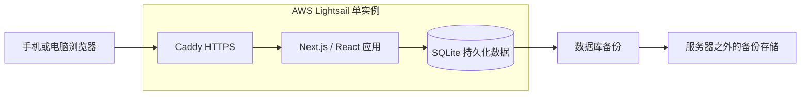

# Authright_Voting 设计文档

版本：v1.1 本地实现  
更新日期：2026-09-25  
状态：核心功能已实现并通过本地检查；AWS 尚未部署。验收边界见[项目状态](项目状态.md)。  
界面与文档语言：简体中文

## 1. 产品定位

为约 30–40 人的小规模活动提供轻量、有趣的投票体验。品牌名称为“Authright_Voting”。任何人都可以从起始页入口创建活动，发起者无需注册；参与者通过分享链接匿名投票，管理员负责全局管理和历史记录查询。

产品应做到：

- 创建流程简短，问题、选项、时间在一个页面中完成。
- 手机操作顺畅，打开链接即可理解并参与。
- 投票状态清楚，提交反馈明确，结果易于阅读。
- 历史记录可靠保存，管理链接丢失后有人工处理入口。
- 通过单实例部署降低初期维护成本。

本版本采用文字问题和文字选项，支持单选。封面上传、附件等功能不属于当前开发范围。

## 2. 角色与访问边界

| 角色 | 识别方式 | 可以执行的操作 |
| --- | --- | --- |
| 访问者 | 无需登录 | 创建活动；查看已知链接对应的活动；查看已结束活动的结果 |
| 参与者 | 服务器签发的匿名浏览器身份 | 在有效时间内投一票；查看自己已投活动的当前结果 |
| 发起者 | 私密管理链接换取活动管理会话 | 查看该活动全部统计；分享活动；提前关闭该活动 |
| 管理员 | 用户名、密码和服务端会话 | 查询全部活动；查看统计；关闭、归档活动；重置管理链接；查询管理操作记录 |

起始页向所有访问者提供“发起投票”入口，不公开列出全部活动。全站历史活动列表仅管理员可见。首页的三步使用说明、品牌文字和管理员入口同属页尾；内容较短时页尾贴住视口底部，内容较长时排在正文之后，不遮挡主按钮。管理员入口只在首页页尾显示；管理员登录页仍可通过 `/admin/login` 直接访问。

“匿名”指参与者无需填写姓名、邮箱等身份资料。公开页和管理页展示汇总统计，不提供按参与者查看选票的功能。系统内部仍需要匿名标识完成防重复。

## 3. 核心业务规则

### 3.1 创建与发布

第一版字段约定如下；长度与数量限制属于实现默认值，可在开发时统一配置。

| 字段 | 规则 |
| --- | --- |
| 标题 | 必填，去除首尾空格后 1–100 字符 |
| 说明 | 选填，最多 1,000 字符，按纯文本展示 |
| 选项 | 2–8 个；每项 1–100 字符；去除首尾空格后不得重复 |
| 开始时间 | 默认立即开始，可预约未来时间 |
| 截止时间 | 必填，必须晚于开始时间，发布时尚未过期 |

发布前可以修改全部字段。发布时服务端再次校验；“立即开始”使用服务器时间确定开始时间。

发布成功后向发起者展示**两条不同的链接**：

| 链接 | 交给谁 | 用途 |
| --- | --- | --- |
| 投票链接 | 分享给参与者 | 查看活动、匿名投票；投票后看当前结果，结束后看最终结果 |
| 我的结果链接（私密） | 发起者自己保存 | 随时查看该活动的统计和结果，并进行已约定的单场管理操作 |

活动编号用于定位活动，不构成第三条链接。二维码由投票链接生成，不提供额外的访问权限。发布成功页需明显区分两条链接，并提醒发起者不要公开转发私密链接。

发布后锁定标题、说明、选项、开始时间和截止时间。第一版不延长、重开或修改已发布活动；内容有误时由发起者关闭后重新创建。

发布失败时保留表单内容。创建请求携带幂等标识，网络重试返回同一创建结果，避免生成多个活动。私密令牌可在浏览器中临时保留用于本次重试，服务器只保存其哈希；成功后不将明文令牌写入普通日志。

### 3.2 状态与时间

| 状态 | 判断依据 | 参与行为 |
| --- | --- | --- |
| 未开始 | 当前时间早于开始时间，且未手动关闭 | 展示标题、说明、开始时间和提示；当前页面不展示可选卡片，不可提交 |
| 进行中 | 已到开始时间、尚未到截止时间，且未手动关闭 | 未投票者可提交 |
| 已结束 | 已到截止时间，或已手动关闭 | 停止提交，所有访问者可看最终结果 |

归档是独立的管理标记，不改变投票状态。管理员只能归档已结束的活动；归档后公开结果链接仍然可访问，后台可以筛选查看并取消归档。

时间统一以 UTC 时间戳存储，界面按访问者的本地时区显示，并在创建表单和活动详情中标明时区。分享链接在不同地区打开时显示当地对应时间。

截止规则由服务端执行：在投票写入事务内读取服务器当前时间，只有满足“开始时间 ≤ 当前时间 < 截止时间”且未关闭的请求才可以写入。以此检查时刻作为接收判定时刻。页面倒计时不具备授权作用。

到期状态可以直接根据时间计算，不依赖定时任务修改数据库。手动关闭记录关闭时间；关闭与投票写入通过事务串行处理，关闭提交后的新投票会被拒绝。

### 3.3 投票与重复提交

- 每场活动只能选择一个选项，确认提交后不可修改或撤回。
- 提交按钮旁提示“提交后不可修改”。
- 同一匿名身份在同一场活动最多保留一张选票。
- 同一身份重复提交相同选项时返回已有成功结果，不重复计票。
- 同一身份尝试提交其他选项时返回“你已投票，无法修改”。
- 只有服务器确认写入成功后，页面才进入已投票状态。
- 请求超时后可以查询已有选票状态或安全重试，不直接认定投票失败。
- 选项必须属于当前活动，不能通过构造请求跨活动投票。

### 3.4 结果可见性

| 场景 | 可见内容 |
| --- | --- |
| 未开始、尚未投票 | 页面展示活动说明、时间与状态；公开接口包含选项，但不返回票数 |
| 进行中、尚未投票 | 可选择选项；不返回总票数、各项票数、占比或趋势 |
| 进行中、已经投票 | 当前总票数、各项票数与占比，标记自己的选择 |
| 已结束 | 所有人可查看最终总票数、各项票数与占比 |
| 发起者或管理员已通过权限校验 | 随时查看总票数、各项票数与占比、投票趋势 |

结果访问权限由服务端控制。未获得权限时，HTML、接口响应和页面预加载数据均不能包含隐藏统计。包含权限差异的结果响应不进入公共共享缓存。

进行中结果标记“当前结果”，结束后标记“最终结果”。并列最高票明确标记并列；零票时所有占比为 0，不指定获胜选项。占比独立四舍五入后总和可能不恰好等于 100%。

### 3.5 历史与找回

- 保留所有活动、选项、有效选票和管理员操作记录。
- 第一版不提供永久删除活动或直接修改票数的操作。
- 发起者丢失链接后，由管理员人工核实并重置。
- 活动编号、标题和公开说明都是公开信息，不能单独作为所有权证明。
- 无法核实归属时，不向请求者交付管理权限；管理员仍能处理关闭等管理事务。
- 重置后旧令牌和该活动已有的发起者管理会话立即失效。
- 新管理链接只在重置成功后向管理员展示，不写入审计日志。

## 4. 页面与交互

以下为已实现的主要页面路由。

| 页面 | 目标路径 | 核心内容 |
| --- | --- | --- |
| 起始页 | `/` | 简短介绍和醒目的“发起投票”入口；三步说明、品牌文字与管理员入口组成页尾 |
| 创建页 | `/create` | 标题、说明、选项、开始和截止时间、发布操作 |
| 发布成功页 | `/created/[publicId]` | 活动编号、公开链接、二维码、私密管理链接及保存提示 |
| 投票与结果页 | `/p/[publicId]` | 状态、倒计时、选项、提交反馈、符合权限的结果 |
| 发起者管理页 | `/manage/[publicId]` | 实时统计、趋势、公开链接与二维码、提前关闭 |
| 管理员登录页 | `/admin/login` | 用户名、密码、登录反馈 |
| 后台总览与活动列表 | `/admin` | 累计活动数、进行中活动数、累计票数、搜索与筛选、分页 |
| 后台活动详情 | `/admin/polls/[publicId]` | 活动详情、统计、关闭、归档、获取公开分享链接、重置管理链接 |
| 操作记录 | `/admin/audit` | 操作者类型、时间、活动编号、动作、分页 |

“累计”指标包含归档活动；默认活动列表排除已归档活动，用户可切换为全部记录。单场详情可以查看其相关管理操作。

私密管理链接当前采用 `/manage/[publicId]#key=...`：令牌位于 URL 片段中，由页面通过同源请求换取管理会话，成功后从地址栏移除。管理页刷新时使用会话，跨设备进入时使用保存的完整链接。

投票提交期间禁用重复点击。网络错误保留选择，允许重试；已过期、已投票、链接失效和无权限分别给出中文反馈。

公开投票页、发起者管理页和后台活动详情目前复制的是完整投票 URL；尚未实现把聊天中的链接显示为投票题目或为每场投票生成独立的分享卡片标题。局域网 IP 链接主要用于同一网络内打开和投票，分享预览方案需在确定目标平台与公网地址后继续设计。

投票结束时，公开页在标题附近显示一处持续可见的半透明“已结束”印章，同时展示最终结果。手机内置浏览器在 React 接管前可能给根 `<html>` 注入属性；当前根布局仅对该节点抑制 hydration 属性警告，页面内部的其他不一致仍需排查。

### 4.1 视觉方向

- 当前采用第四套“浅色系统实验室”方向，品牌名为“Authright_Voting”；详细颜色、排版和组件规则见[视觉规范](视觉规范.md)。
- 浅灰白背景、深色文字、钴蓝主操作和浅蓝选中面，以清晰层级和留白引导操作。
- 标题使用清楚的大字；选择卡片采用浅灰蓝细边框与小圆角，选中时通过浅蓝底色、钴蓝边界和勾选符号共同表达状态。
- 使用轻微位移和统计条过渡，提交成功后显示明确的确认提示。
- 剩余时间明显但不持续闪烁，长期活动显示天或小时，临近结束时显示更精确的时间。
- 首页去除示例投票卡片，突出主按钮；三步说明置于页尾，和正文布局分离。创建页和后台沿用同一色彩与标题语言；后台优先保证表格和筛选器清楚，手机上使用适配布局。
- 支持键盘操作、可见焦点、表单标签和减少动画偏好；状态表达不只依赖颜色。
- 最小目标点击区域约 44 × 44 像素，覆盖窄屏手机到桌面布局。

当前页面使用“Authright_Voting”品牌名。投票标题、说明和选项由发起者填写；固定提示语以当前页面实现为准，视觉概念图中的演示内容不作为系统文案。

## 5. 技术架构

| 层次 | 选择 | 职责 |
| --- | --- | --- |
| 页面 | React + TypeScript | 页面组件、表单、投票状态、管理界面 |
| 应用框架 | Next.js App Router | 路由、服务端渲染、接口与权限校验 |
| 样式与组件 | Tailwind CSS 4、自定义组件 | 响应式样式、表单和后台组件 |
| 动画与图表 | CSS 动画与轻量柱状图 | 交互反馈和统计展示 |
| 数据访问 | better-sqlite3 | 参数化 SQL、事务、数据库备份接口 |
| 数据库 | SQLite | 持久化活动、选票、会话及审计数据 |
| 输入校验 | Zod 4 | 创建和投票请求校验 |
| 部署 | Docker Compose + Caddy + AWS Lightsail Linux | 单实例运行、HTTPS、持久化目录 |

不使用 Prisma。数据库访问集中在服务端模块中，SQL 使用参数绑定，浏览器无法直接访问数据库。涉及 SQLite 的代码运行在 Node.js 运行时。

首版运行一个应用实例，SQLite 文件放在该实例的本地持久化磁盘。启用 WAL、外键约束和有限的锁等待时间，事务保持简短；锁等待耗尽时返回可重试的提示。

有权限的活动页面每 5 秒读取一次统计，页面隐藏时暂停轮询，恢复可见时立即更新。选项统计由选票聚合计算，保证显示结果与选票记录一致。这个规模下先直接查询，避免维护另一套可失配的计票缓存。

发起者页面显示按时间分桶的投票趋势；分桶宽度随活动时长调整，鼠标悬停时显示时段。管理员接口也返回趋势数据，后台详情目前只展示结果分布。参与者结果页只展示当前分布。

## 6. 数据模型

下表是逻辑模型，具体结构见 `db/migrations/001_initial.sql`。时间统一使用 UTC 毫秒时间戳。

| 表 | 主要字段与约束 |
| --- | --- |
| `polls` | 内部 ID、随机公开编号、标题、说明、开始/截止时间、手动关闭时间、归档时间、管理令牌哈希、管理令牌版本、创建幂等键、创建时间 |
| `poll_options` | 选项 ID、活动 ID、文本、显示顺序；建立活动内选项身份约束 |
| `votes` | 选票 ID、活动 ID、选项 ID、匿名身份摘要、提交时间；活动 ID 与匿名身份摘要组合唯一 |
| `admin_users` | 管理员 ID、唯一用户名、密码哈希、创建/更新时间；首版只初始化一个账号 |
| `sessions` | 会话令牌哈希、类型、管理员 ID 或活动 ID、活动管理令牌版本、到期时间、创建时间 |
| `audit_logs` | 管理员或发起者类型、关联管理员 ID、活动 ID、动作、时间 |
| `schema_migrations` | 已执行的 SQL 迁移编号、执行时间 |

选票通过活动 ID 与选项 ID 的组合外键关联选项，防止选项来自其他活动。管理令牌版本用于撤销旧的发起者会话。

活动公开编号使用不可预测的随机值，不暴露连续内部 ID。活动时间、选票时间、状态筛选字段及常用关联字段按查询建立索引。

关闭活动、重置链接、归档和取消归档等持久化变更与对应审计记录在同一事务内提交。

## 7. 身份、权限与基础防重复

### 7.1 匿名身份

服务器签发高强度随机匿名标识，放入签名 Cookie。生产环境启用 `HttpOnly`、`Secure` 和合适的 `SameSite` 设置。签名防止篡改，但用户清除 Cookie 后仍能获得新身份。

数据库保存按活动派生的匿名身份摘要，用于查询是否已投票和执行唯一约束。正常使用不要求填写姓名、邮箱或手机号，也不建立参与者名单。

投票接口同时验证活动状态、选项归属和匿名身份，唯一约束是并发防重复的最终保障。页面的“已投票”状态只用于反馈，不作为服务端计票依据。

### 7.2 管理员与发起者权限

- 管理员密码使用成熟密码派生算法，例如 Node.js `scrypt` 配合独立随机盐。
- 使用不可预测的会话令牌；数据库只存令牌哈希，会话有到期时间，并支持注销与撤销。
- 初始管理员由服务器命令初始化，凭据不写入源码，也不提供默认公开密码。
- 发起者会话仅对指定活动有效，不能访问全局后台或其他活动。
- 管理链接重置时同步递增令牌版本并撤销已有活动管理会话。
- 接口逐次执行权限检查，不能只依靠页面跳转或隐藏按钮。
- 管理链接、密码、Cookie 和会话令牌不进入普通日志或审计详情。

### 7.3 限流与请求处理

在单实例应用内，对创建活动、投票、登录、管理令牌兑换分别设置有限的请求频率。投票按匿名身份限流，并对来源 IP 设置较宽松的异常请求限制；IP 不作为一人一票的标识。

第一版可使用内存限流计数，明确其重启后会清零；选票唯一约束始终由数据库执行。代理来源地址只信任 Caddy 转发的可信链路，避免客户端伪造。

写入接口使用 POST 等适当方法，并验证同源请求及 CSRF 防护；限制请求大小，对标题和说明按纯文本渲染。基础版本不依赖第三方机器人验证服务。

## 8. 持久化、备份与维护

- 数据库文件及 WAL 相关文件所在目录整体挂载到持久化数据目录，应用镜像升级不覆盖数据。
- 使用 SQLite 在线备份机制生成一致性备份，不在数据库写入期间仅复制主数据库文件。
- 建议每天备份、升级前额外备份，保留最近 7 份日备份和 4 份周备份；至少一份存放在服务器之外。
- 每日备份意味着故障恢复时可能丢失最近一次成功备份后的数据；活动期间可提高备份频率。
- SQLite 备份应通过完整性检查，并在首次上线及备份流程变更后验证恢复。
- 密钥和部署配置另行安全保存。丢失或更换匿名身份签名密钥会影响已有浏览器身份，需要提前安排。
- SQL 迁移按编号执行并记录，升级前备份；应用回滚前核实新旧数据库结构兼容性。
- 采用单机架构，机器故障会导致暂时不可用。维护流程以可恢复、可验证为目标。

## 9. 验收要求

| 范围 | 必须验证的行为 |
| --- | --- |
| 创建与分享 | 字段规则正确；重复发布请求不创建多场；公开链接和管理链接用途分离 |
| 时间 | 预约开始前拒绝投票；截止及提前关闭后拒绝投票；不受浏览器时间修改影响 |
| 计票 | 同一身份并发提交只产生一票；重试不重复计票；选项归属验证正确 |
| 并发 | 用约 40 个独立匿名身份同时提交，成功提交数与实际选票数一致；对失败请求可安全重试 |
| 结果权限 | 未投票者不能从接口或页面数据读取进行中票数；已投者及管理者可查看；结束后公开 |
| 管理权限 | 未登录不能访问后台；单场会话不能越权；重置链接后旧令牌与旧会话失效 |
| 历史 | 归档不删除记录；搜索、筛选和历史结果正常；管理变更有审计记录 |
| 持久化 | 重启和重新部署后数据仍在；备份能恢复活动、票数与管理数据 |
| 界面 | 手机和桌面可用；键盘可操作；中文反馈完整；减少动画设置生效 |

## 10. 参考资料

- [Next.js：React 全栈框架](https://nextjs.org/docs)
- [Next.js 自托管指南](https://nextjs.org/docs/app/guides/self-hosting)
- [SQLite 适用场景](https://www.sqlite.org/whentouse.html)
- [SQLite 在线备份](https://www.sqlite.org/backup.html)
- [better-sqlite3 项目与文档](https://github.com/WiseLibs/better-sqlite3)
- [AWS Lightsail 快照](https://docs.aws.amazon.com/lightsail/latest/userguide/amazon-lightsail-faq-snapshots.html)
